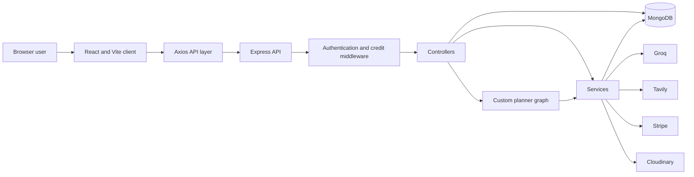
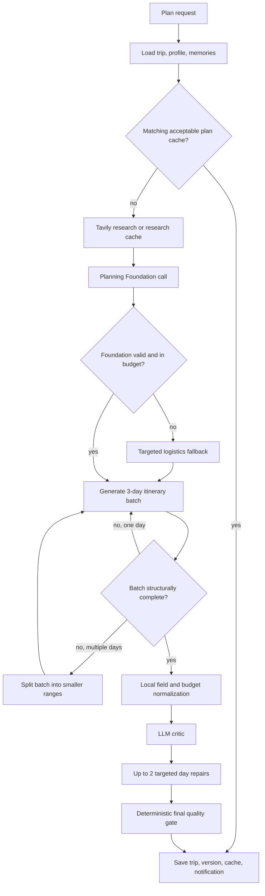
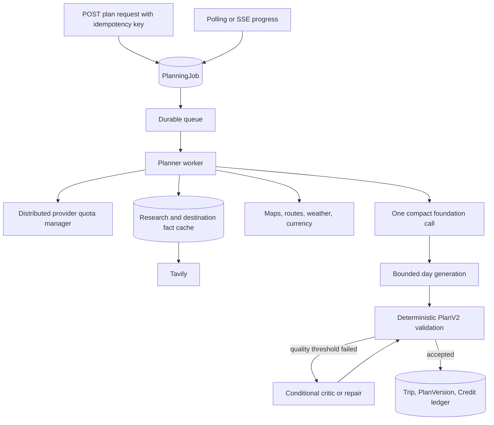

# RoamPilot Current Architecture Handoff for Claude

Verified against the codebase: 2026-06-30

## 1. Purpose of this document

This document describes the architecture that RoamPilot actually has today,
including its working features, AI orchestration, persistence, reliability
controls, known weaknesses, and constraints that must be preserved.

The goal is to give Claude enough context to propose a better production
architecture without assuming that RoamPilot is a greenfield project.

Do not treat older architecture documents in this repository as authoritative.
Some of them still describe Groq Compound research, separate strategy and
logistics calls, or two-day itinerary batches. The current implementation is
described here.

## 2. Product summary

RoamPilot is a full-stack agentic AI travel-planning application. A user can:

- create a trip manually through a question-by-question flow;
- describe a trip in natural language and receive an editable draft;
- answer guided planning questions;
- generate a detailed multi-day itinerary;
- review real workflow progress from specialist agents;
- refine or regenerate individual days;
- optimize a budget and transform a plan;
- chat with the saved trip;
- request current web research;
- manage expenses, checklists, documents, emergency information, and memories;
- save versions and restore an older plan;
- share a read-only public trip;
- store one trip for offline access;
- manage a travel profile, subscription, and application credits.

The application uses a custom sequential agent workflow. It does **not** use
LangGraph, LangChain, or another agent framework.

## 3. Technology stack

### Installed frontend stack

- React 18
- Vite 5
- React Router 6
- Zustand
- Axios
- Tailwind CSS
- React Markdown
- `remark-gfm`
- `rehype-raw` with `rehype-sanitize`
- Browser Speech Recognition for voice input
- Browser local storage for authentication state and offline-trip data

### Installed backend stack

- Node.js using ES modules
- Express 4
- MongoDB with Mongoose 8
- JWT authentication
- bcrypt password hashing
- Groq JavaScript SDK
- Native `fetch` for Tavily
- Stripe
- Cloudinary and Multer
- Node's built-in test runner

### External systems currently used

| System | Current responsibility |
|---|---|
| MongoDB Atlas | All persistent application data |
| Groq | Trip interpretation, itinerary generation, chat, critic, repair, and AI helper endpoints |
| Tavily | Current web research for plans and freshness-sensitive chat |
| Stripe | Checkout, subscription lifecycle, billing portal, and webhook processing |
| Cloudinary | Uploaded trip documents |
| Browser local storage | JWT, theme, Zustand persistence, and user-isolated offline trip |

### Candidate tools not currently installed

These are options for Claude to evaluate, not existing dependencies:

- Redis for distributed locks, shared quotas, caching, and idempotency;
- BullMQ or another durable job queue;
- Zod, Joi, or Valibot for request and plan schema validation;
- Pino for structured logs;
- OpenTelemetry and Sentry for tracing and error monitoring;
- Google Maps Platform, Mapbox, or OpenRouteService for geocoding and routes;
- a weather provider such as OpenWeather;
- a currency-rate provider;
- a hotel/flight provider such as Amadeus or Duffel.

## 4. Top-level architecture



The client and server are separate applications:

```text
client/
  React application

server/
  Express application
```

The default local URLs are:

```text
Client: http://localhost:5173
Server: http://localhost:5000
Health: http://localhost:5000/api/health
```

## 5. Frontend architecture

### Routing

Public routes:

- `/`
- `/login`
- `/signup`
- `/share/:shareId`

Authenticated routes:

- `/dashboard`
- `/profile`
- `/trips/new`
- `/trips/:id`
- `/trips/:id/planner`
- `/trips/:id/chat`
- `/trips/:id/bookings`
- `/trips/:id/documents`
- `/trips/:id/expenses`
- `/trips/:id/checklist`
- `/trips/:id/versions`
- `/trips/:id/emergency`
- `/trips/:id/memory`
- `/offline`
- `/notifications`
- `/settings`
- `/billing`

`ProtectedRoute.jsx` verifies the stored session, loads billing information,
renders the responsive navigation shell, and exposes nested private pages.

### State management

Zustand stores:

| Store | Responsibility |
|---|---|
| `authStore.js` | User and authentication state |
| `billingStore.js` | Subscription and available credit state |
| `themeStore.js` | Light/dark theme state |
| `tripStore.js` | Active trip-related client state |

Axios reads the JWT from a namespaced browser-storage key and sends it as:

```http
Authorization: Bearer <token>
```

Response interceptors:

- clear the session on HTTP 401;
- update credit state from response headers;
- dispatch a billing event on HTTP 402.

### Planner UI

`AIPlanner.jsx` is the main planning surface. It:

1. loads the trip;
2. loads deterministic planning questions;
3. stores guided answers;
4. starts plan generation;
5. polls `GET /api/ai/plan-progress/:workflowId`;
6. renders persisted workflow steps through `AgentProgress.jsx`;
7. renders the plan, budget, sources, critic notes, and daily cards;
8. invokes transformations and individual-day regeneration.

The workflow progress is real server state, not a simulated animation.

### Theme and responsive layout

The current visual system uses a forest-green dark theme with emerald/lime
accents. Common `.card`, `.input`, `.btn-primary`, and `.btn-secondary`
utilities live in `client/src/index.css`.

Important current UI constraints:

- the sidebar is fixed-width on large screens;
- mobile uses a top navbar;
- dark-mode classes must be explicit for translucent light backgrounds;
- the former global floating voice dock is no longer mounted because it
  obscured actions;
- voice controls remain inline on supported forms.

### Offline behavior

One trip can be saved in browser storage for offline use. Offline keys are
user-specific, and the saved object includes an owner identifier. Old
unscoped offline records are intentionally not migrated.

This is not a full service-worker/PWA synchronization architecture.

## 6. Backend HTTP architecture

`server/src/app.js`:

- configures an explicit CORS allowlist;
- exposes selected credit headers;
- mounts the Stripe raw-body webhook before JSON middleware;
- accepts JSON bodies up to 10 MB;
- mounts domain routers;
- exposes a basic liveness endpoint;
- finishes with a central error handler.

### Main route groups

| Prefix | Responsibility |
|---|---|
| `/api/auth` | Signup, login, current user, profile update |
| `/api/profile` | Travel preference profile |
| `/api/trips` | Trip CRUD and AI description parsing |
| `/api/ai` | Planning, progress, chat, research, transformations, helpers |
| `/api/documents` | Cloudinary-backed uploads |
| `/api/versions` | Plan version history and restore |
| `/api/expenses` | Trip expenses and summaries |
| `/api/checklists` | Trip checklist |
| `/api/share` | Public read-only share |
| `/api/emergency` | Emergency information |
| `/api/memories` | Saved trip preferences and feedback |
| `/api/notifications` | User notifications |
| `/api/billing` | Plans, checkout, billing portal, subscription summary |

### AI endpoints

| Method and endpoint | Behavior |
|---|---|
| `POST /api/ai/plan-trip` | Runs the full planner workflow synchronously |
| `GET /api/ai/plan-progress/:workflowId` | Returns persisted progress |
| `POST /api/ai/planning-questions` | Returns deterministic guided questions |
| `POST /api/ai/chat-trip` | Trip-aware chat with conditional Tavily research |
| `GET /api/ai/chat-history/:tripId` | User-isolated chat history |
| `POST /api/ai/regenerate-day` | Regenerates one day |
| `POST /api/ai/optimize-budget` | AI budget optimization plus local normalization |
| `POST /api/ai/create-packing-list` | AI packing list |
| `POST /api/ai/safety-guide` | AI safety guide |
| `POST /api/ai/transform-trip` | Applies a broad plan transformation |
| `POST /api/ai/score-trip` | Returns the stored plan score |
| `POST /api/ai/research-trip` | Explicit Tavily-backed research |

The routes that consume application credits use `requireCredits(action)`.

## 7. Authentication, authorization, and isolation

### Current authentication

- Passwords are hashed with bcrypt.
- Successful authentication returns a JWT.
- The JWT is stored in browser local storage.
- Private routes use `protect`.
- Controllers normally scope private records by both object ID and `userId`.

### Current administrator behavior

There is no role or permission model in the `User` schema. "Admin" behavior is
currently an email allowlist configured through `CREDIT_EXEMPT_EMAILS`.

An exempt user:

- bypasses application credit charging;
- receives `X-Credit-Exempt: true`.

An exempt user does **not** bypass:

- Groq rate limits;
- Tavily limits or failures;
- MongoDB failures;
- plan validation;
- provider configuration.

This should be replaced by an explicit role/permission model if administration
will grow beyond local development.

### Data isolation

- MongoDB uses the explicit database name from `MONGO_DB_NAME`.
- Private collections use `userId`.
- Planner and research caches include user ownership.
- Public shares copy a limited plan snapshot behind a random share ID.
- Browser authentication and offline keys are application- and user-scoped.

## 8. Core data model

### Primary entities

| Model | Main purpose |
|---|---|
| `User` | Identity, password hash, avatar |
| `TravelProfile` | Persistent planning preferences and constraints |
| `Trip` | Trip input and the current `aiPlan` |
| `TripVersion` | Restorable historical plan snapshot |
| `TripMemory` | Likes, dislikes, pace, food, and budget feedback |
| `ChatMessage` | User-isolated trip conversation |
| `PlanningRun` | Workflow progress and failure state |
| `PlannerCache` | Exact-input completed-plan cache |
| `ResearchCache` | User/trip/focus Tavily result cache |
| `Subscription` | Plan, Stripe identifiers, and credit balances |
| `CreditTransaction` | Idempotent credit ledger |
| `Expense` | Trip expense |
| `ChecklistItem` | Trip checklist entry |
| `Document` | Cloudinary document metadata |
| `EmergencyInfo` | Emergency contacts and data |
| `SharedTrip` | Public share snapshot |
| `Notification` | User notifications |

### Trip model

`Trip` contains:

- owner;
- title, origin, and destination;
- dates and traveler count;
- budget and currency;
- travel style and planning mode;
- must-visit and avoid lists;
- notes and lifecycle status;
- `aiPlan` as an untyped Mongoose `Mixed` object;
- last generation timestamp.

### Current AI plan shape

The current plan is a large JSON object. Important sections include:

```text
tripTitle
summary
destinations[]
route[]
dayThemes[]
nonNegotiableConstraints[]

budgetBreakdown
budgetSummary
dailySpendingTargets[]
transportStrategy[]
flightSuggestions[]
hotelSuggestions[]
foodPlan[]
packingList[]
safetyTips[]
weatherNotes[]
alternatives[]
warnings[]
emergencyCard

dayWiseItinerary[]
  day
  date
  theme
  summary
  startArea
  endArea
  walkingEstimate
  advanceBookings[]
  schedule[]
    time
    duration
    activity
    location
    details
    openingHours
    entryFee
    travelTime
    transport
    routeDistance
    estimatedCost
    bookingRequired
    bookingAdvice
    sourceUrl
  meals[]
  dailyBudget
  rainyDayAlternative
  localTip
  paceNotes

tripScore
criticNotes[]
researchSources[]
generationContext
```

Legacy morning/afternoon/evening/night arrays are derived before persistence
for compatibility with older UI code.

### Plan schema weakness

`Trip.aiPlan`, `PlannerCache.plan`, and `TripVersion.fullPlan` are Mongoose
`Mixed`. Runtime validators cover important fields, but there is no single
authoritative versioned schema or migration layer.

The current cache/workflow version is `7`.

## 9. Current AI planning workflow

### Entry point

`POST /api/ai/plan-trip` accepts:

```text
tripId
instructions
useWebSearch
planningAnswers
workflowId
```

The controller:

1. validates trip ownership;
2. acquires an in-process user/trip lock;
3. creates a `PlanningRun`;
4. loads profile and recent memories;
5. calculates inclusive trip duration;
6. builds an exact-input cache key;
7. reuses a matching completed plan when allowed;
8. runs the custom planner graph;
9. validates minimum itinerary structure;
10. persists the plan, version, cache, and notification;
11. completes or fails the progress record;
12. releases the in-process lock.

### Current cache policy

- Completed plans are cached for 12 hours.
- The cache key includes version, owner, trip input, compiled profile,
  memories, instructions, answers, and research setting.
- A plan generated without successful live research is not reused when the new
  request requires research.
- A cache hit refunds the AI credit charge.

### Workflow diagram



### Detailed stages

#### 1. Intent stage

Deterministic. It reports normalized days, travelers, currency, and budget.
It does not consume Groq tokens.

#### 2. Research stage

- Optional.
- Uses Tavily, not Groq Compound.
- Uses one concise query capped at 390 characters.
- Uses basic search depth and typically five or six results.
- Includes an answer and source excerpts.
- Serializes Tavily requests with a minimum interval.
- Retries transient network, HTTP 429, and provider 5xx failures.
- Caches successful results for six hours by user, trip, and research focus.
- Marks research text as untrusted before it is inserted into an LLM prompt.
- Failure is non-fatal; planning continues with a visible safe status.

#### 3. Planning Foundation stage

One Groq call produces two objects:

```text
strategy
logistics
```

The strategy contains route, day themes, constraints, and research sources.
The logistics object contains budget, transport, stays, food, packing, safety,
weather, alternatives, warnings, and emergency information.

This replaced separate strategy and logistics model calls.

If logistics is incomplete or exceeds the stated budget, only logistics is
regenerated with a strict budget correction prompt. A deterministic budget
engine then reconciles category totals and computes:

- expected spend;
- savings;
- shortfall;
- status;
- emergency-buffer guidance;
- optional-upgrade capacity.

An over-budget result can never be labelled "comfortable."

#### 4. Day Architect stage

- Default batch size: three days.
- Output budget depends on days in the section.
- Each day needs at least four schedule entries and two meals.
- Missing safe fields are repaired locally.
- An incomplete multi-day batch is split into smaller ranges.
- An incomplete single day receives one bounded correction.
- The entire workflow only stops when one day remains structurally incomplete
  after its final correction.

#### 5. Critic stage

One Groq call receives a compact complete itinerary and scores:

- overall quality;
- budget realism;
- time realism;
- safety;
- route efficiency;
- rest balance;
- food quality.

It may request at most two day repairs.

Critic failure is optional and does not discard an otherwise complete plan.

#### 6. Targeted repair stage

- Rewrites only critic-selected days.
- Uses a larger output allowance than before.
- Has one compact retry for invalid or truncated JSON.
- Applies deterministic safe-field normalization before acceptance.
- Accepts a structurally complete repair even if minor quality notes remain.
- Removes stale critic notes for successfully repaired days.

#### 7. Final quality gate

Deterministic checks include:

- exact day count;
- minimum schedule and meal structure;
- placeholder wording;
- concrete activity and location names;
- numeric time/cost fields;
- daily budget arithmetic;
- duplicate attractions across different days;
- trip-wide budget arithmetic.

Same-day repeated locations are not falsely reported as cross-day duplicates.
Remaining issues are stored as human-readable review notes rather than raw
object paths.

## 10. Groq request architecture

All Groq access goes through:

```text
server/src/services/groqService.js
```

### Current controls

- One global in-process promise queue serializes Groq requests.
- Default minimum request interval: 2.1 seconds.
- A rolling 60-second estimated token window is maintained per model.
- Default TPM safety ratio: 80%.
- An optional exact TPM override can be configured.
- Known model limits provide conservative initial values.
- Actual limit headers update the observed model limit.
- Requests reserve estimated input plus maximum output tokens.
- Actual usage replaces the reservation after a successful response.
- HTTP 429 retries respect `retry-after` or token-reset headers.
- Daily-limit failures are not repeatedly retried.
- Invalid/truncated JSON may receive one compact retry where configured.
- JSON requests use Groq JSON object mode.

### Normal six-day call profile

Without fallbacks or critic repairs:

| Work | Provider calls |
|---|---:|
| Tavily research | 0 or 1 |
| Planning Foundation | 1 Groq |
| Days 1-3 | 1 Groq |
| Days 4-6 | 1 Groq |
| Critic | 1 Groq |
| Total Groq | About 4 |

Additional calls occur when:

- foundation JSON is invalid;
- logistics is incomplete or over budget;
- a day batch must be split;
- a single day needs correction;
- the critic requests up to two repairs.

### Important limitation

The queue, token window, and user/trip lock are process-local. Multiple Node
instances do not coordinate. A restart also clears the limiter history.

## 11. Tavily architecture

All Tavily access goes through:

```text
server/src/services/tavilyService.js
```

Current behavior:

- bearer authentication from `TAVILY_API_KEY`;
- optional project header;
- 390-character normalized query;
- default basic search;
- bounded result count and content length;
- no raw page content;
- safe HTTP/HTTPS source URL filtering;
- one global in-process queue;
- minimum request interval;
- timeout and jittered retries;
- safe error messages for configuration, authentication, quota, timeout,
  network, provider, and empty-result failures.

Tavily results are reference data. They are never treated as trusted
instructions.

## 12. Chat architecture

Chat history is stored per user and trip. The client sends one message at a
time.

The backend:

1. saves the user message;
2. loads the latest eight messages;
3. builds a compact trip-aware prompt;
4. classifies whether the question needs current research;
5. calls Tavily only for freshness-sensitive requests;
6. inserts the result as untrusted reference data;
7. performs one Groq synthesis call;
8. saves the assistant reply.

Ordinary plan questions do not use Tavily.

## 13. Guided questions and trip creation

### Manual creation

The frontend uses a one-question-at-a-time wizard. It preserves the original
trip payload and includes:

- progress;
- required and optional answers;
- back, next, and skip controls;
- inline voice input on supported text fields;
- final client validation.

### AI description parsing

`POST /api/trips/parse-description` sends a natural-language trip description
to Groq, parses JSON, and opens the same editable manual flow at the first
missing answer.

### Planning interview

The planning interview is deterministic and does not spend model tokens. It
uses trip/profile state to ask only relevant questions and returns normalized
answer IDs consumed by the planner cache and prompts.

## 14. Billing and credits

Application credits are separate from provider quotas.

Configured paid plans:

- Explorer
- Navigator
- Voyager

There is also a small weekly free allowance.

AI operations have fixed credit costs. Full planning currently costs 18
RoamPilot credits.

Credit middleware:

1. checks whether the user is exempt;
2. atomically attempts to consume credits;
3. stores an idempotent ledger transaction;
4. exposes updated balance headers;
5. attaches a refund callback;
6. attempts an automatic refund for failed HTTP responses.

Stripe webhooks grant subscription credits and update subscription state.

Provider limits are independent. Having application credits or an exempt user
does not guarantee Groq or Tavily availability.

## 15. Failure behavior

| Failure | Current behavior |
|---|---|
| Tavily unavailable | Continue without live research and show safe reason |
| Foundation invalid JSON | One compact retry |
| Strategy incomplete | Targeted strategy fallback |
| Logistics incomplete/over budget | Targeted logistics fallback |
| Multi-day batch incomplete | Split into smaller batches |
| Single-day batch incomplete | One bounded correction, then fail |
| Critic unavailable | Keep structurally validated plan |
| Day repair invalid | Retry compactly, otherwise retain original day |
| Final minor quality issues | Save plan with review notes |
| Exact acceptable cache hit | Reuse plan and refund planning credits |
| Duplicate same-trip request in one process | Return conflict through in-memory lock |

## 16. Main code locations

### Backend

| File | Responsibility |
|---|---|
| `server/src/app.js` | Express composition |
| `server/src/controllers/aiController.js` | AI endpoints, cache, persistence |
| `server/src/agents/graph.js` | Custom planner orchestration and validation |
| `server/src/prompts/plannerPrompt.js` | Foundation, day, critic, and repair prompts |
| `server/src/prompts/chatPrompt.js` | Compact trip chat prompt |
| `server/src/prompts/planningQuestionsPrompt.js` | Guided question definitions |
| `server/src/services/groqService.js` | Groq queue, pacing, retries |
| `server/src/services/tavilyService.js` | Search, formatting, retries |
| `server/src/services/budgetEngine.js` | Deterministic budget arithmetic |
| `server/src/services/planningProgressService.js` | Persisted workflow state |
| `server/src/services/researchCacheService.js` | User/trip research cache |
| `server/src/services/creditService.js` | Credit balances and ledger |
| `server/src/middlewares/creditMiddleware.js` | Charge/refund lifecycle |
| `server/src/models/Trip.js` | Current trip and mixed AI plan |
| `server/src/models/PlanningRun.js` | Progress |
| `server/src/models/PlannerCache.js` | Completed exact-input plans |

### Frontend

| File | Responsibility |
|---|---|
| `client/src/App.jsx` | Application routes |
| `client/src/pages/CreateTrip.jsx` | Manual wizard and AI description |
| `client/src/pages/AIPlanner.jsx` | Planning workflow and plan display |
| `client/src/components/ai/AgentProgress.jsx` | Persisted agent progress |
| `client/src/components/itinerary/ItineraryDayCard.jsx` | Detailed day UI |
| `client/src/components/ai/ChatBox.jsx` | Trip chat |
| `client/src/components/ai/FormattedMessage.jsx` | Sanitized rich AI output |
| `client/src/components/common/ProtectedRoute.jsx` | Private application shell |
| `client/src/api/axiosInstance.js` | JWT and billing interceptors |
| `client/src/index.css` | Forest design system and compatibility layer |

## 17. Environment contract

Required or supported variable names:

```text
PORT
MONGO_URI
MONGO_DB_NAME
JWT_SECRET
JWT_EXPIRES_IN
CLIENT_URL

GROQ_API_KEY
GROQ_MODEL
GROQ_PLANNER_MODEL
GROQ_AGENT_MODEL
GROQ_ITINERARY_MODEL
GROQ_ITINERARY_BATCH_SIZE
GROQ_MIN_INTERVAL_MS
GROQ_TPM_LIMIT
GROQ_TPM_SAFETY_RATIO

TAVILY_API_KEY
TAVILY_PROJECT_ID
TAVILY_MIN_INTERVAL_MS
TAVILY_TIMEOUT_MS
RESEARCH_CACHE_TTL_HOURS

CLOUDINARY_CLOUD_NAME
CLOUDINARY_API_KEY
CLOUDINARY_API_SECRET

STRIPE_SECRET_KEY
STRIPE_WEBHOOK_SECRET
STRIPE_EXPLORER_PRICE_ID
STRIPE_NAVIGATOR_PRICE_ID
STRIPE_VOYAGER_PRICE_ID

WEEKLY_FREE_CREDITS
CREDIT_EXEMPT_EMAILS
```

No secret values are included in this document.

## 18. Verified quality state

At the time of this handoff:

- server syntax checks pass;
- 33 Node server tests pass;
- the client production build passes;
- Tavily accepts a normalized 390-character query and returns sources.

The existing tests are mostly unit tests. They do not constitute a complete
production reliability suite.

## 19. Strengths that should be preserved

1. Real persisted workflow progress.
2. User-isolated trips, memories, chat, caches, and versions.
3. Exact-input completed-plan caching.
4. Research caching and safe source handling.
5. Deterministic budget normalization.
6. Bounded day generation instead of one enormous prompt.
7. Adaptive batch splitting.
8. Targeted day repair instead of full regeneration.
9. Graceful optional research and critic stages.
10. Credit refund on cache hit and failed HTTP actions.
11. Prompt-injection boundary around external research.
12. Human-readable fallbacks and quality notes.
13. Existing plan output shape and UI features.
14. The ability to run locally without introducing a large platform stack.

## 20. Current architectural weaknesses

### P0: reliability

1. `POST /plan-trip` remains open for the entire workflow. Client polling does
   not make the server job asynchronous.
2. A process crash can lose active work after credits have been charged.
3. Completed stages are not checkpointed for resume after failure.
4. Groq/Tavily queues and trip locks are process-local.
5. Horizontal scaling can exceed provider limits or generate the same trip
   concurrently.
6. No durable job ownership, lease, heartbeat, or dead-letter queue exists.
7. Model fallbacks can increase calls substantially after a malformed batch.

### P0: correctness

1. Travel time, opening hours, prices, routes, and venue existence are still
   mostly model-generated strings.
2. No geocoder, place-ID system, route matrix, or opening-hour engine exists.
3. Research is a broad text result rather than structured destination facts.
4. `aiPlan` has no authoritative versioned runtime/database schema.
5. The final gate can accept a structurally complete plan with minor quality
   notes.
6. Budget correction is model-assisted; it is not a constrained optimization
   solver based on verified prices.

### P1: efficiency

1. Each day batch repeats substantial trip and foundation context.
2. The critic still reviews deterministic issues that local validators also
   inspect.
3. Repairs resend a complete day and full schema.
4. Cache is exact-input only; there is no sanitized shared destination
   knowledge cache.
5. Chat, transformations, safety, packing, and budget helpers use inconsistent
   context and validation strategies.

### P1: maintainability

1. `aiController.js` and `graph.js` have too many responsibilities.
2. Prompt construction, provider calls, validation, orchestration, and
   persistence are only partially separated.
3. There is no typed domain contract shared by client and server.
4. Older documentation has drifted from the implementation.
5. Encoding artifacts remain in some older source strings.

### P1: security

1. JWT is stored in local storage rather than a secure HttpOnly cookie.
2. No general API/IP rate limiter is installed.
3. No Helmet security-header middleware is installed.
4. No central schema-validation middleware is installed.
5. JSON body limit is 10 MB globally.
6. Admin behavior is an email allowlist rather than RBAC.
7. Security testing and dependency scanning are not part of the documented
   workflow.

### P1: observability and testing

1. Provider calls do not have durable traces linking user request, job, stage,
   tokens, latency, retry, and cost.
2. `/api/health` is liveness only, not readiness.
3. There is no dashboard for queue depth, cache hit rate, token use, provider
   failures, or stage quality.
4. Integration tests do not fully cover auth, credits, Stripe, provider errors,
   persistence, and idempotency.
5. There is no browser-level end-to-end planning test.

## 21. Non-negotiable redesign constraints

Claude's improved architecture should:

1. Preserve all current major user features.
2. Avoid a rewrite unless a phased migration justifies it.
3. Preserve existing API behavior during migration or provide an explicit
   compatibility layer.
4. Preserve existing stored plans and versions through schema migration.
5. Keep Tavily as the web-search provider.
6. Keep Groq as an inference provider initially.
7. Never rotate multiple accounts or keys to bypass provider quotas.
8. Reduce normal Groq calls and tokens without making plans less detailed.
9. Prevent duplicate billing and duplicate plan jobs.
10. Work correctly with multiple server instances.
11. Make optional provider failure graceful.
12. Use deterministic tools for routing, arithmetic, dates, validation, and
    other non-generative tasks.
13. Protect private user/trip data sent to providers.
14. Keep infrastructure proportional to the current product stage.
15. Provide a local-development path that remains simple.

## 22. Questions Claude should answer

1. Should the custom orchestrator remain, or is LangGraph justified now?
2. What is the smallest viable durable-job architecture?
3. Should Redis/BullMQ be introduced immediately or in a later phase?
4. How should per-user, per-trip, and provider-wide idempotency work?
5. What should a versioned `PlanV2` schema contain?
6. How should existing `Mixed` plans migrate safely?
7. Which stages should be deterministic, tool-backed, or LLM-backed?
8. Can the critic become primarily deterministic?
9. How should provider quota reservations work across many Node instances?
10. How should partial stage checkpoints resume after a crash?
11. How should research become structured, sourced destination intelligence?
12. Which maps/routes/places/weather APIs offer the best cost/reliability
    tradeoff?
13. How should exact plans, destination facts, and provider results be cached
    separately?
14. What plan-quality metrics should block saving versus create warnings?
15. How should credits settle transactionally for success, cache hit,
    cancellation, timeout, and partial failure?
16. Which security changes are required before public deployment?
17. What observability fields and dashboards are essential?
18. What should be implemented in each migration phase?

## 23. Requested response format for Claude

Use the following prompt with this document:

> You are the Principal AI and Platform Architect reviewing RoamPilot. Treat
> this document as the verified current architecture. Design a production-ready
> improved architecture that preserves all major functionality and improves
> correctness, reliability, latency, provider-rate safety, privacy, and
> maintainability. Do not propose vague microservices or a full rewrite.
>
> Return:
>
> 1. a concise assessment of the current architecture;
> 2. a target architecture diagram;
> 3. a detailed planning-job sequence diagram;
> 4. the proposed `PlanV2` and `PlanningJob` schemas;
> 5. deterministic versus LLM versus external-tool responsibilities;
> 6. distributed rate-limit, idempotency, retry, timeout, and circuit-breaker
>    algorithms;
> 7. provider abstraction and fallback strategy;
> 8. privacy and security design;
> 9. observability and test strategy;
> 10. a phased migration plan with exact repository file changes;
> 11. expected Groq call/token reduction for a six-day trip;
> 12. tradeoffs, costs, prerequisites, and rollback plan for every phase.
>
> Separate recommendations into:
>
> - Phase 0: no new infrastructure;
> - Phase 1: low-risk code/schema improvements;
> - Phase 2: durable jobs and distributed coordination;
> - Phase 3: verified travel-data tools and advanced optimization.
>
> Explicitly identify anything that should not be changed yet.

## 24. Preferred architecture direction

This is a direction for Claude to critique, not a mandated answer:



The expected end state is:

- request returns `202 Accepted` with a durable job ID;
- one worker owns the job through a lease;
- credits are reserved once and settled exactly once;
- static research and tool facts are cached independently;
- plan inputs and outputs use versioned schemas;
- provider calls use distributed quota reservations;
- routing, dates, arithmetic, duplicates, and opening-hour conflicts are
  deterministic;
- LLMs focus on interpretation, personalization, selection, and narrative;
- failed jobs resume from checkpoints;
- UI progress survives refreshes, restarts, and multiple application nodes.
