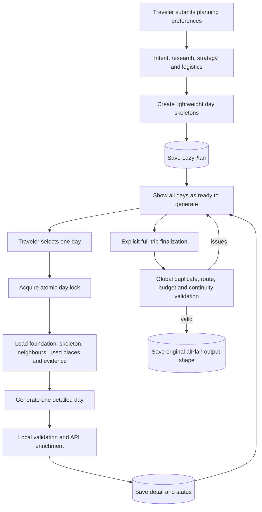
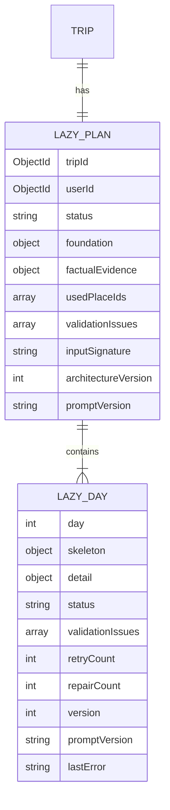
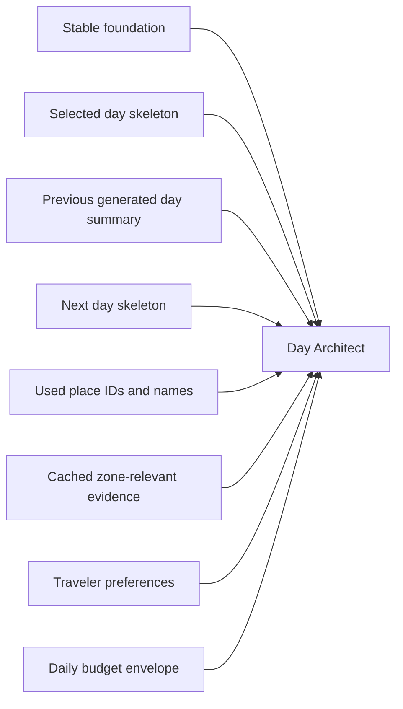

# RoamPilot Lazy Day Planner Architecture

## Goal

Reduce initial latency, Groq token pressure, timeout risk, and wasted generation without changing the final published itinerary shape.

The initial request now creates only:

- destination and traveler understanding
- route and city/zone strategy
- deterministic budget and daily envelopes
- major transfers and accommodation guidance
- one lightweight skeleton for every trip day
- cached factual evidence for later day generation

Detailed schedules are generated one day at a time.

## Runtime flow



## Statuses

### Day status

| Status | Meaning |
|---|---|
| `pending` | Skeleton exists; no detailed generation was requested |
| `generating` | This day owns the current atomic generation lock |
| `completed` | Detail passed blocking local checks |
| `failed` | Only this day failed; other days remain usable |
| `needs_repair` | Detail is saved and viewable but has blocking local/global issues |

### Plan status

| Status | Meaning |
|---|---|
| `foundation_generating` | Initial route and budget work is running |
| `foundation_ready` | All skeletons are ready |
| `partially_generated` | At least one detailed day is saved |
| `ready_to_finalize` | Every day passed local validation |
| `repair_required` | A local or global issue needs a targeted day repair |
| `completed` | Deterministic final assembly passed |
| `failed` | Foundation generation failed |

## Data model



`LazyPlan` is separate from `Trip`, so existing trips and legacy `aiPlan` documents remain compatible.

## Day-generation context

Each day request receives only the information needed for that day:



Completed days are never regenerated by the normal generate endpoint. Explicit repair/regeneration uses a separate endpoint and increments the day version.

## Destination coverage and experience policy

Before skeletons are saved, RoamPilot now creates a deterministic coverage plan:

1. User must-visits receive highest priority.
2. Foundation highlights supported by current research are added.
3. Geoapify attractions, heritage, museums, nature, parks, beaches, and religious places are ranked.
4. Hotels, restaurants, and cafes are excluded from the sightseeing inventory.
5. Selected places are distributed across geographically relevant day skeletons.
6. Every selected day records `requiredPlaces`, experience types, and a minimum real-experience count.

Relaxed mode means two meaningful visits plus an unhurried local experience. It does not mean replacing destination coverage with hotel rest.

Geoapify is queried in two cached groups:

- destination experiences within a configurable wider rural radius
- hotels and food within a smaller support radius

This prevents accommodation results from crowding major sights out of the factual evidence supplied to the model.

The “Use live web research” control applies only to Tavily. Geoapify, OpenRouteService,
Open-Meteo, and Nager.Date remain active because they provide structured facts rather
than optional web-search prose. Attraction and support candidates are balanced before
prompting so the model receives sights, food options, cafes, and stay logistics together.

## API contract

| Method | Endpoint | Purpose |
|---|---|---|
| `POST` | `/api/ai/lazy-plan/initialize` | Generate/reuse foundation and skeletons |
| `GET` | `/api/ai/lazy-plan/:tripId` | Restore all lazy-plan statuses |
| `POST` | `/api/ai/lazy-plan/day` | Generate one pending/failed day |
| `POST` | `/api/ai/lazy-plan/day/repair` | Explicitly repair or regenerate one day |
| `POST` | `/api/ai/lazy-plan/finalize` | Run global validation and deterministic assembly |

Foundation initialization uses the existing full-plan credit boundary. Day endpoints require ownership of that paid lazy plan and do not repeatedly charge for the same trip.

## Validation

### Local validation

Runs after each generated day:

- required schedule and meal structure
- concrete named places and descriptions
- numeric travel time and costs
- daily budget arithmetic and envelope deviation
- duplicate attractions against completed days
- repeated food warnings
- previous-day continuity
- API place and route enrichment
- required destination-place coverage
- minimum real experiences for the selected pace
- excessive hotel/check-in filler

### Global validation

Runs only when the traveler finalizes:

- exact day count
- cross-day duplicate attractions
- missing inter-zone transfers
- budget component arithmetic
- hard-budget verdict
- generic wording
- evidence coverage
- all existing final quality-gate rules

Global failure does not delete the complete draft. It marks affected days `needs_repair` and keeps every generated day viewable.

## Final output compatibility

During generation, `Trip.aiPlan.dayWiseItinerary` contains only saved detailed days.

After finalization, the backend deterministically builds the same existing shape:

```json
{
  "tripTitle": "...",
  "summary": "...",
  "route": [],
  "budgetBreakdown": {},
  "hotelSuggestions": [],
  "transportStrategy": [],
  "dayWiseItinerary": [],
  "criticNotes": [],
  "tripScore": {},
  "generationContext": {}
}
```

Existing workspace, itinerary-card, gallery, budget, chat, export, and map consumers therefore continue reading the same fields.

## Resume and caching

- The foundation has an input signature based on trip constraints, planning answers, research preference, architecture version, and prompt version.
- An identical initialization request reuses the foundation and refunds its AI credit reservation.
- Every completed day is stored independently.
- A failed day is retried independently.
- A stale `generating` lock becomes `failed` after three minutes and can be retried.
- Used verified place IDs are stored and sent to later day generations.
- Provider evidence is stored once with the foundation and provider-level caches remain active.

## Optional prefetch

Automatic next-day prefetch is intentionally not enabled in the first increment. It is optional and could create unwanted model work when the traveler does not open another day.

A later implementation may prefetch only when all are true:

- the traveler opted in
- the next day is still `pending`
- no other day owns a lock
- model capacity reports sufficient headroom
- the current request has completed
- the task runs in a durable background worker

This preserves the core guarantee: initial planning never generates all detailed days.
