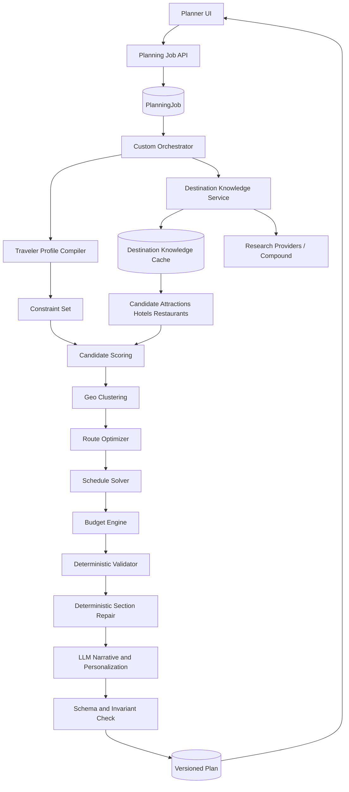

# RoamPilot Architecture Audit and Architecture V2

Status: baseline audit completed; low-risk V2 foundations implemented afterward  
Reviewed: 2026-06-29

## 1. Executive assessment

RoamPilot is not a LangGraph application. It has a custom, sequential agent
workflow in `server/src/agents/graph.js`. The current design is a solid
prototype: it has bounded day generation, progress reporting, retries, version
history, personalization inputs, caching, and targeted repairs.

The main limitation is architectural, not prompt quality. The LLM currently
performs selection, routing, budgeting, scheduling, validation, scoring, and
writing. Several of those are deterministic problems. As a result:

- a normal seven-day plan approaches the Scout per-minute token budget;
- generated routes and costs cannot be proven correct;
- one weak model field can create repair work or low-quality fallback data;
- the same destination is researched repeatedly;
- profile data exists but much of it never reaches the planner;
- more model calls increase latency and the number of failure points.

Architecture V2 should keep the custom orchestrator and evolve it
incrementally. A framework migration is not required. The key change is to
make a deterministic plan the source of truth and use the LLM for
personalization, interpretation, and narrative.

### Implementation progress after this audit

The following low-risk items from Phases 1-2 are now implemented without
changing the stored itinerary shape:

- deterministic, free planning interview;
- complete traveler-profile compiler used by prompts and cache keys;
- user-isolated exact-plan cache keys and refunds for cache hits;
- six-hour user-scoped research cache;
- deterministic budget arithmetic, savings and buffer summary;
- conditional chat routing so only freshness-sensitive questions use web search;
- compact itinerary context for ordinary chat;
- safe provider-error messages in workflow progress;
- same-process per-trip generation lock;
- cleanup of plan/research/progress caches when deleting a trip;
- query indexes for core trip, memory, version, chat, cache and run lookups;
- UI fields for existing accessibility, transport and lifestyle preferences;
- visible expected-spend, savings and budget-fit summary.

Shared destination knowledge, geographic routing, async workers, Redis quota
coordination and the Plan V2 schema remain future phases because they require
new data or infrastructure.

## 2. Current system map

```text
React/Vite client
  -> Axios + bearer JWT
  -> Express routes
  -> auth and AI-credit middleware
  -> AI controller
  -> custom planner graph
       -> Compound Mini research
       -> Scout strategy
       -> Scout logistics
       -> Scout day batches
       -> Scout critic
       -> optional Scout repairs
  -> Trip/Version/Cache/PlanningRun in MongoDB
```

Supporting systems:

- Stripe subscriptions and application credits;
- Cloudinary document storage;
- trip sharing, expenses, checklists, emergency data and notifications;
- travel profile, manually saved trip memory and browser offline storage;
- 12-hour exact-plan cache and 24-hour planning-progress records.

### Current planner stages

1. Intent stage reports normalized input but does not build a canonical profile.
2. Optional research returns one Markdown response.
3. Strategy creates routes and day themes.
4. Logistics creates budgets, hotels, transport, food, weather and safety.
5. Day Architect generates two-day batches.
6. Local normalization fills some missing fields and totals.
7. LLM critic scores the complete plan.
8. Up to two LLM repairs rewrite selected days.
9. Final validation records remaining issues as notes and saves the plan.

### Current model-call and token profile

Approximation for a representative seven-day trip. Input tokens are estimated
from current prompt size; output values are configured maximums, not actual
usage.

| Stage | Calls | Approx. input | Max output |
|---|---:|---:|---:|
| Planning interview | 1 | 400-600 | 1,000 |
| Live research (Compound) | 1 | 250-400 | 800 |
| Strategy | 1 | 750 | 1,200 |
| Logistics | 1 | 1,100 | 1,200 |
| Three two-day batches | 3 | 1,450 each | 3,600 each |
| One one-day batch | 1 | 1,450 | 2,000 |
| Critic | 1 | 1,750 | 900 |
| Repairs | 0-2 | about 800 each | 1,200 each |

The core Scout workflow reserves approximately 25,000-26,000 tokens before
repairs. Planning questions and research bring the full interaction near
28,000 requested tokens across models. Retries can increase this substantially.
The Scout baseline is 30K TPM, and the local limiter uses a 90% safety ratio,
so a seven-day plan is expected to require pacing even without concurrency.

## 3. Strengths to preserve

1. **Incremental orchestration:** bounded stages are easier to debug than one
   full-plan prompt.
2. **Day batching:** avoids requesting an entire itinerary in one completion.
3. **Targeted repair:** only selected days are rewritten.
4. **Graceful optional stages:** unavailable research or critic output does not
   always destroy a complete plan.
5. **Progress visibility:** `PlanningRun` provides real persisted progress,
   rather than a simulated UI timer.
6. **Exact-input plan cache:** repeat generation can avoid all model calls.
7. **Version history:** generated and modified plans can be restored.
8. **User isolation pattern:** most private queries include `userId`.
9. **Token safeguards:** per-model queues, response-header limits, bounded
   retries and compact retries are already present.
10. **Credit refunds:** failed HTTP AI actions attempt to return credits.
11. **Prompt-injection awareness:** web research is explicitly marked as
    untrusted reference data.
12. **Existing personalization foundation:** profile, guided answers, memories,
    instructions and planning modes already exist.

## 4. Architectural weaknesses and bottlenecks

### P0: reliability and correctness

#### 4.1 Long synchronous planning request

`POST /api/ai/plan-trip` remains open while every model stage and database write
completes. The client polls progress, but the actual generation is still tied
to one HTTP request. Proxy/serverless timeouts, client disconnects and process
restarts can lose the response or produce uncertain credit state.

#### 4.2 Process-local quota coordination

Groq queues and token windows are JavaScript maps. They reset on restart and
are not shared by multiple server instances. Horizontal scaling can therefore
exceed one organization quota even when each process believes it is safe.

#### 4.3 No per-trip generation lock

Two clicks, browser retries or multiple tabs can create concurrent workflows
for the same trip. They can consume credits twice and race to overwrite
`trip.aiPlan`.

#### 4.4 Cache ownership and invalidation

`PlannerCache.cacheKey` is globally unique, but cache lookup uses only
`cacheKey`, not `userId`. A cross-user plan cache should not also contain
private ownership metadata. Private exact-plan cache and sanitized shared
destination cache need separate contracts.

The cache key includes only part of `TravelProfile`. Hotel preference,
preferred transport, medical constraints, accessibility needs, nightlife,
shopping and experience level are omitted. Changes to those fields neither
alter the prompt nor invalidate the plan cache.

#### 4.5 Mixed, unversioned plan data

`Trip.aiPlan`, cached plans and versions are Mongoose `Mixed`. Runtime checks
cover only parts of the object. There is no authoritative schema migration,
making old/new plans and UI expectations easy to desynchronize.

#### 4.6 Provider text is treated as operational data

Opening hours, costs, distances, ratings and travel times are generated as
strings. There are no coordinates, time windows, source timestamps or
confidence fields. Route correctness and closure conflicts cannot be proven.

### P1: excessive or misplaced AI work

#### 4.7 Research is not destination intelligence

Research returns Markdown and is not cached independently by destination,
season or freshness. Different trips to the same place repeat web research.
Only excerpts are passed forward, and facts are not stored as structured,
source-linked records.

#### 4.8 Routing is prompt-based

The strategy and day prompts ask the LLM to cluster places, minimize
backtracking and estimate travel. No geocoding, Haversine distance, travel-time
matrix, opening-hour filter or route solver exists.

#### 4.9 Budgeting is prompt-based

The model invents category allocations and daily targets. Local code checks
addition but does not establish realistic baselines, reserve policy, group
scaling, per-night cost or insufficient-budget classification.

#### 4.10 Critic duplicates deterministic validation

Duplicate detection, missing fields, arithmetic and basic structure already
exist locally. The critic is still asked to re-check those items after
receiving the entire itinerary, consuming about 2,500 requested tokens.

#### 4.11 Repeated context

Each day batch repeats trip context, profile, memory, strategy, budget,
transport and hotels. Most of this can be replaced by a compact,
batch-specific constraint object.

#### 4.12 Planning interview is usually deterministic

The built-in fallback questions already cover pace, priority, food, mobility
and constraints. A model call is used to produce minor wording and
destination-specific choices. A deterministic question selector can eliminate
this call for most trips.

#### 4.13 AI helper endpoints have inconsistent architecture

- `optimizeBudget` delegates arithmetic to an LLM.
- `safetyGuide` asks for “verified” facts without web research.
- `createPackingList` could mostly use weather/activity rules and templates.
- `transformTrip` resends the complete plan into a small output budget and is
  likely to truncate multi-day plans.
- `regenerateDay` omits profile, memory, route constraints and fresh research.
- chat invokes Compound web search for every message, even when freshness is
  unnecessary.
- `scoreTrip` returns an old score without recalculating after all mutations.

### P1: personalization gaps

The model has fields for many preferences, but the planner uses only budget
type, food, pace, interests and adventure level. It does not consistently use:

- hotel preference;
- preferred transport;
- medical and accessibility constraints;
- nightlife and shopping preferences;
- climate and language comfort;
- travel experience level;
- family composition and child ages;
- dietary restrictions/allergies as structured constraints;
- wake/sleep times and hiking tolerance.

Trip memory is manually entered and only recent prior-trip snippets are sent to
the model. There is no confidence, provenance, conflict resolution or automatic
learning from edits/completed activities.

### P2: maintainability, security and observability

1. No central request-schema validation or allowlisted update DTOs.
2. No general API/IP rate limiting or security-header middleware is visible.
3. JWT is stored in localStorage, increasing XSS impact.
4. `/api/health` checks Express only, not Mongo/readiness/queue health.
5. Provider error text can be persisted and displayed in workflow details.
6. Credit debit, ledger write and refund are not one database transaction.
7. Common query paths lack consistent compound indexes.
8. Encoding artifacts such as `·`, `→` and malformed icons exist.
9. `mockWeatherService` is unused.
10. `AGENTIC_PLANNER.md` has drifted from current batching/token behavior.
11. Tests cover utilities and one happy planner graph, but not provider
    failures, concurrency, cache ownership, API integration or browser flows.

## 5. Deterministic work that should leave the LLM

| Responsibility | Current owner | Architecture V2 owner |
|---|---|---|
| Duration/date calculation | Controller/LLM context | Date engine |
| Traveler constraint merge | Prompt | Profile compiler |
| Budget classification/allocation | LLM logistics | Budget engine |
| Arithmetic and reserves | LLM + partial checks | Budget engine |
| Attraction hard filtering | LLM | Constraint engine |
| Geographic clustering | LLM | Geo clustering |
| Route order | LLM | Route optimizer |
| Transfer estimates | LLM | Distance/time engine |
| Opening-hour feasibility | LLM critic | Schedule validator |
| Meal-time windows | LLM | Schedule engine |
| Duplicate detection | Local regex + LLM | Deterministic validator |
| Walking limits | LLM | Mobility constraint engine |
| Structural validation | Local + LLM repair | Versioned schema validator |
| Score calculation | LLM critic | Deterministic weighted score |
| Question selection | LLM/fallback | Rule-based interview |
| Packing basics | LLM | Rules/templates; LLM only for edge cases |
| Prose and explanations | LLM | Narrative engine |
| Preference interpretation | LLM | LLM only for unstructured text |

## 6. Architecture V2: AI Travel Brain



### 6.1 Traveler Profile Compiler

Produce one immutable `TravelerProfileSnapshot` for each planning job.

Precedence:

```text
trip hard constraints
  > current guided answers
  > explicit saved profile
  > high-confidence memories
  > safe defaults
  > optional LLM inference from free text
```

Each field should include value, source and confidence. The snapshot should
cover pace, comfort, hotel tier/type, diet/allergies, photography, nightlife,
spirituality, shopping, adventure, hiking tolerance, wake time, mobility,
family/child ages, language comfort and transport preference.

No LLM is needed for explicit form values. Use one small extraction call only
when unstructured notes contain unresolved preferences.

### 6.2 Destination Knowledge Service

Research once and persist structured, reusable facts:

- destination identity, coordinates and timezone;
- attractions with category, coordinates, duration, cost, opening windows,
  closed days, accessibility, indoor/outdoor, source and freshness;
- restaurants with cuisine, dishes, price band, meal windows, dietary support,
  coordinates, rating source and freshness;
- hotels/areas with tier, nightly range, coordinates and suitability tags;
- local and intercity transport;
- permits, safety, weather/season and hidden gems.

Use field-specific TTLs. Weather and closures may expire in hours/days; stable
coordinates can last months. Shared cache must contain sanitized destination
facts only, never private trip notes or memories.

### 6.3 Budget Intelligence

Build a deterministic feasible baseline from destination cost bands:

```text
fixed = intercity transport + rooms * nights
variable = travelers * days * (food + activities + local transport)
expectedSpend = fixed + variable
spendable = userBudget - emergencyBuffer - shoppingBuffer
coverageRatio = spendable / expectedSpend
```

Initial classification bands, calibrated later with real data:

- `< 0.90`: insufficient;
- `0.90-1.25`: comfortable;
- `1.25-1.75`: generous;
- `> 1.75`: luxury capacity.

Do not automatically consume surplus. Return expected spend, savings,
emergency buffer, optional shopping buffer and ranked upgrades. Maintain the
invariant that every total equals its components.

### 6.4 Candidate selection engines

Attraction, hotel and restaurant engines should share a deterministic ranking
model:

```text
score =
  preference fit
  + quality/confidence
  + route proximity
  + seasonal suitability
  + budget fit
  - mobility penalty
  - closure risk
  - duplication penalty
```

Hard constraints such as closed dates, accessibility, dietary safety, avoid
lists and budget ceilings run before scoring.

### 6.5 Route and schedule optimization

Start simple:

1. Geocode candidates once.
2. Group candidates by geographic area.
3. Assign one major cluster/theme per day.
4. Order each cluster using nearest-neighbor insertion.
5. Insert meals, transfers, rest and arrival/departure constraints.
6. Reject entries outside opening windows.
7. Calculate walking and transport totals.
8. Keep alternatives in the same cluster.

Haversine distance plus conservative mode speeds is sufficient for V2.1.
Add a map travel-time provider later behind an adapter. Do not introduce a
complex optimizer until benchmark cases show the greedy solver is inadequate.

### 6.6 Deterministic validator and repair engine

Return machine-readable issues:

```json
{
  "code": "OPENING_HOURS_CONFLICT",
  "severity": "error",
  "day": 2,
  "itemId": "activity-17",
  "actual": "scheduled 18:00",
  "expected": "closes 17:00",
  "repair": "move_or_replace"
}
```

Validate schema, unique venues, time windows, transfer feasibility, meal
windows, walking, budget invariants, accessibility, hotel continuity and source
freshness. Repair by moving, replacing or dropping only the failing item.
Escalate to an LLM repair only when the deterministic engine cannot resolve a
semantic conflict.

### 6.7 Narrative engine

The LLM receives a solved, compact plan and may:

- explain why each day works;
- personalize descriptions and local tips;
- produce concise booking guidance;
- make the itinerary readable and engaging.

It must not change venue IDs, coordinates, times, costs, route order or
constraints. Narrative output should be merged into the canonical plan by ID.

### 6.8 Orchestration and infrastructure

Keep the custom graph but make stages resumable and artifact-based:

- return `202 Accepted` with `workflowId`;
- run planning in a worker;
- persist stage input/output and status;
- use an idempotency key and one active lock per trip/input hash;
- use a shared Redis token bucket and queue for multiple instances;
- retry only transient provider errors once;
- use circuit breakers for research/model providers;
- settle credits transactionally when the job completes or fails.

LangGraph is optional and currently unnecessary. The domain engines and data
contracts are more important than the orchestration library.

## 7. Proposed data contracts

Add incrementally:

1. `PlanningJob` — evolves `PlanningRun` with input hash, lock, stage artifacts,
   retry counts, timestamps, cancellation and credit settlement state.
2. `DestinationKnowledge` — sanitized reusable destination facts and per-field
   freshness/source metadata.
3. `PlanV2` schema — typed itinerary, stable IDs, numeric money/duration,
   coordinates, sources, confidence and `schemaVersion`.
4. `TravelerProfileSnapshot` — resolved preferences with source/confidence.
5. `PlanEvaluation` — deterministic issues and benchmark scores.

Continue reading legacy `aiPlan` during migration. Write both legacy display
fields and V2 canonical fields until the client is migrated.

## 8. Migration strategy

### Phase 0: baseline and contracts

- Freeze representative trip fixtures and quality metrics.
- Define Plan V2 JSON schema and issue codes.
- Add integration tests for current behavior.
- Record per-stage latency, input/output tokens and failures.

Trade-off: no visible improvement yet.  
Token impact: none.  
Risk: low.

### Phase 1: deterministic core behind the current graph

- Build profile compiler, money utilities, duration parser and validators.
- Replace LLM arithmetic/scoring with deterministic outputs.
- Feed the existing prompts compact canonical constraints.
- Make planning questions rule-based by default.

Expected token saving: 10-20%.  
Performance: faster validation; one interview/critic call can be removed.  
Risk: low; feature-flag and compare old/new results.

### Phase 2: structured destination knowledge

- Add destination cache and source/freshness metadata.
- Convert one research result into structured candidates.
- Reuse facts across plans and users only after private data is removed.
- Keep current Markdown research as a fallback.

Expected token saving: 10-25% on first plans and more on cache hits.  
Performance: one research call removed on valid cache hits.  
Risk: stale facts; mitigate with field TTLs and source timestamps.

### Phase 3: routing, scheduling and budget engines

- Add candidate scoring, geo clusters, route ordering and time-window solver.
- Generate a canonical schedule before narrative.
- Use LLM day generation only as fallback during rollout.

Expected token saving: additional 20-35%.  
Performance: deterministic computation should take milliseconds after data is
cached.  
Risk: poor source coordinates/hours; retain confidence and conservative
buffers.

### Phase 4: narrative-only LLM boundary

- Send compact solved day batches to Scout.
- Merge prose by stable item IDs.
- Remove full-itinerary critic; retain semantic repair only for unresolved
issues.
- Batch transformations by affected days rather than resending the full plan.

Expected token saving: additional 15-25%.  
Performance: fewer sequential calls and less rate-limit waiting.  
Risk: narrative/model may contradict facts; reject mutations to canonical
fields.

### Phase 5: asynchronous production orchestration

- Introduce worker, shared limiter, idempotency lock and transactional credit
settlement.
- Resume jobs from persisted artifacts after restart.
- Add cancellation and safe retry.

Token impact: prevents duplicate work rather than reducing one valid plan.  
Performance: more reliable under load; UI receives immediate job acceptance.  
Risk: added operational dependency; begin with one worker and a managed Redis.

### Phase 6: memory and continuous quality

- Learn preferences from explicit edits and post-trip feedback.
- Add provenance, confidence, retention and deletion controls.
- Build destination and trip benchmark dashboards.

Token impact: better targeting reduces repair calls.  
Risk: privacy and incorrect inference; require user visibility and override.

## 9. Expected improvements

These are engineering estimates and must be validated against a fixed
evaluation set.

| Metric | Current | V2 target |
|---|---:|---:|
| Model stages for seven days | 8 baseline, up to 12+ with repairs/retries | 3-5 fresh, 2-4 cached |
| Requested tokens per seven-day interaction | about 25K-30K | 9K-14K fresh, 5K-9K cached |
| Token reduction | baseline | 45-65% fresh, 65-80% cached |
| Repeated destination research | once per non-cached plan | zero while knowledge is fresh |
| Budget arithmetic mismatch | possible | zero by invariant |
| Duplicate canonical attractions | possible | zero after validation |
| Process restart recovery | none | resume from last artifact |
| Multi-instance quota safety | none | shared limiter |
| Expected route backtracking | unmeasured | 15-35% lower distance in benchmark cases |
| Completion success | unmeasured | target above 95% for valid inputs |
| Planning latency | variable and often quota-paced | target 30-60% lower |

Expected quality gains:

- geographically explainable day clusters;
- costs that reconcile and preserve savings/buffers;
- constraints applied consistently across every stage;
- fewer repeated venues/restaurants and impossible schedules;
- personalization based on all explicit profile fields;
- traceable facts with source and freshness;
- localized repairs instead of full regeneration;
- more varied day purposes because themes are assigned from scored user goals,
  not repeated prompt templates.

## 10. Key risks and mitigations

| Risk | Mitigation |
|---|---|
| Incorrect/stale destination data | Source metadata, confidence, per-field TTL and user warning |
| No affordable map provider | Start with cached geocoding + Haversine + conservative speeds |
| Deterministic solver feels less creative | Keep LLM for candidate interpretation and narrative |
| Plan schema migration breaks UI | Dual-read/dual-write and `schemaVersion` |
| Shared cache leaks private data | Separate sanitized knowledge from user-scoped plan cache |
| Background jobs increase operations | Single worker first; managed Redis; resumable stages |
| Profile inference becomes wrong | Source/confidence, explicit precedence and user override |
| Token estimates drift | Record actual Groq usage headers per stage |
| Over-engineering | Deliver phases independently; benchmark before adding complex solvers |

## 11. Acceptance criteria before implementation is considered complete

1. A deterministic fixture suite covers at least 20 representative trips:
   short/long, domestic/international, family, accessibility, luxury, budget,
   food, adventure, multi-city and arrival/departure edge cases.
2. Every plan passes schema, arithmetic, duplication, opening-window, transfer,
   mobility and meal checks.
3. Every current fact has source and freshness metadata.
4. No private profile/memory data enters shared destination cache.
5. Concurrent requests for the same input produce one job and one credit charge.
6. A worker restart resumes rather than regenerates completed stages.
7. Seven-day cached planning stays below 9K requested model tokens.
8. Planner completion exceeds 95% on valid benchmark inputs.
9. User-visible explanations state why venues, hotels, budget and routes were
   chosen.
10. Legacy plans remain readable and restorable throughout migration.

## 12. Files reviewed

- `server/src/agents/graph.js`
- `server/src/controllers/aiController.js`
- `server/src/controllers/tripController.js`
- `server/src/services/groqService.js`
- `server/src/services/planningProgressService.js`
- `server/src/services/creditService.js`
- `server/src/prompts/*`
- `server/src/models/*`
- `server/src/routes/*`
- `server/src/middlewares/*`
- `client/src/pages/AIPlanner.jsx`
- `client/src/components/ai/*`
- `client/src/pages/TravelProfile.jsx`
- `client/src/pages/TripMemory.jsx`
- client API, state and offline-storage modules
- existing architecture, billing, isolation and test documentation
