# RoamPilot Internal Architecture and Reliability Audit

> Current-code architecture, planner execution flow, failure analysis, and an incremental target architecture for producing more specific and reliable itineraries.
>
> Scope: the repository as inspected on 3 July 2026. Sections labelled **Current** describe implemented behavior. Sections labelled **Recommended** are proposals, not existing behavior.

## 1. Executive diagnosis

RoamPilot is a React and Express application with a custom staged AI-planning workflow. It is **agentic**, but it is not implemented with the LangGraph package. `server/src/agents/graph.js` manually executes six stages in sequence:

1. Intent normalization
2. Research and factual-data collection
3. Strategy and budget foundation
4. Batched day architecture
5. Whole-itinerary critic
6. Targeted day repair

After those stages, the coordinator merges the plan, enriches it with travel intelligence, and runs the final quality gate.

The largest reliability flaw is the position of the global quality gate:

- Each day batch can pass local validation and be saved.
- The critic and repair stage then get a maximum of four repair targets.
- Only afterward does the final gate check global concerns such as cross-day transfers, duplicate places, exact aggregate budget arithmetic, and generic wording.
- If that last check finds a critical issue, the request fails even when every day is already complete and saved.

Therefore, “10/10 days saved” currently means **all day documents exist**, not **the complete itinerary is globally valid**.

The main quality flaw is weak factual coverage. The planner receives a bounded candidate set from travel APIs, but it can still invent or repeat names outside that set. Validation is strong at checking shape and wording, but it cannot prove that every generated venue is real, relevant, open, or geographically sensible.

## 2. Technology and system context

### 2.1 Current stack

| Layer | Current implementation |
|---|---|
| Web client | React 18, React Router, Zustand, Axios, Tailwind CSS, MapLibre GL |
| API | Node.js 22, Express 4, Zod request validation |
| Primary data store | MongoDB through Mongoose |
| AI inference | Groq chat-completion models and Groq Whisper speech-to-text |
| Search | Tavily |
| Places and geocoding | Geoapify, with Open-Meteo geocoding fallback |
| Routing | OpenRouteService |
| Weather | Open-Meteo |
| Holidays | Nager.Date |
| Images | Pexels with MongoDB image caching |
| Authentication | JWT/cookies, bcrypt, email OTP through Nodemailer |
| Billing | Razorpay, subscriptions, credits, server-side credit middleware |
| Documents | Cloudinary |
| Deployment shape | Separate Vercel client and server projects |

### 2.2 System context diagram

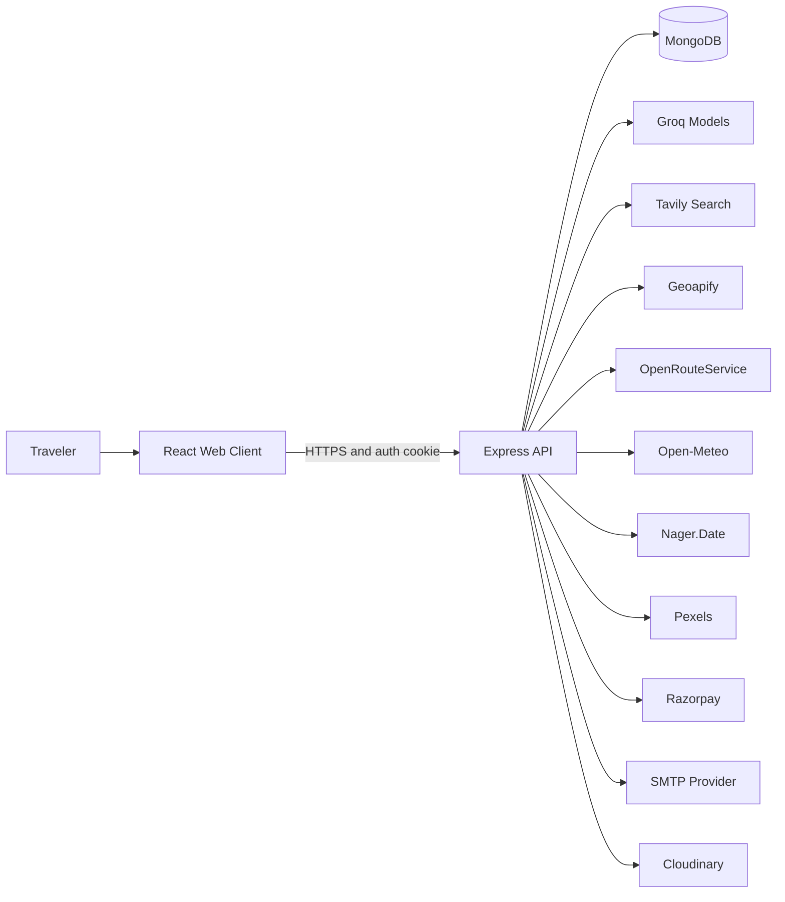

### 2.3 Container-level view

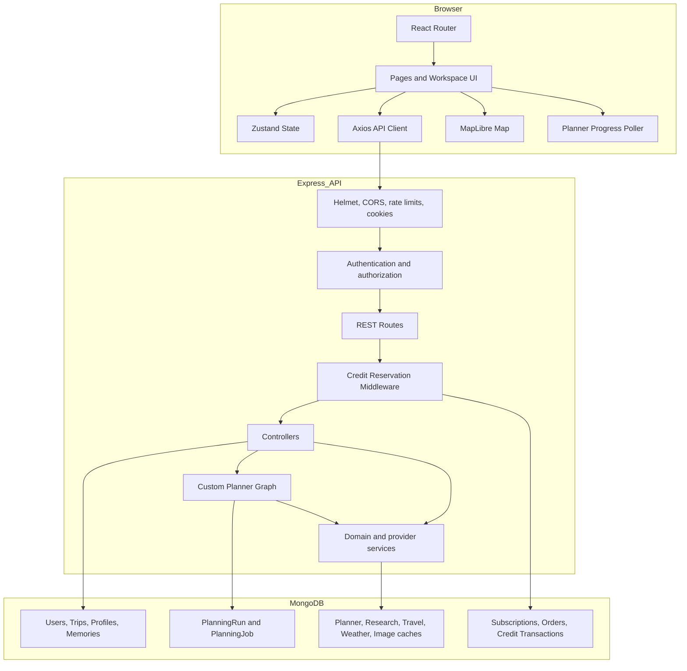

## 3. Current request lifecycle

### 3.1 Planner request sequence

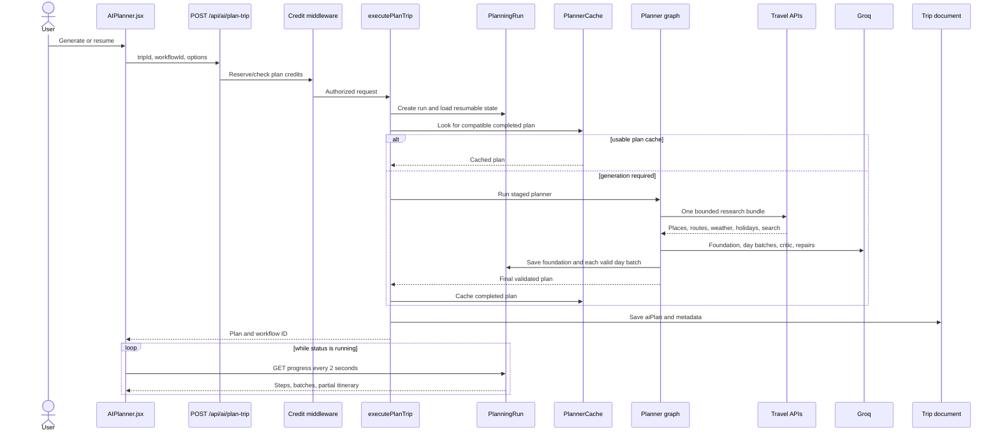

### 3.2 Planner graph

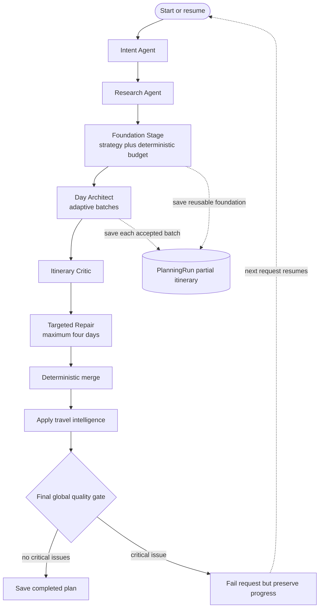

### 3.3 Day generation and safe resume

The batch policy is deliberately bounded:

| Trip length | Maximum generated per request batch |
|---|---:|
| 1–7 days | 3 days |
| 8–17 days | 2 days |
| 18+ days | 1 day |

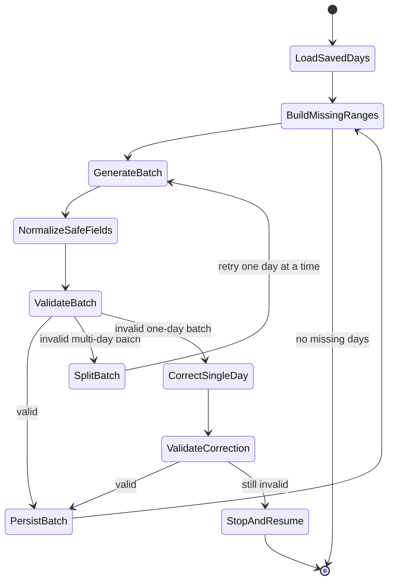

Implemented protections:

- Earlier valid days are not regenerated.
- Multi-day failures are split into single-day calls.
- A single day gets one schema correction attempt.
- A deployment deadline checkpoint saves progress before the hosting limit.
- A heartbeat distinguishes active work from stale work.
- Groq calls are queued and token-budgeted.

These protections improve recoverability, but do not solve final global validation.

## 4. Factual-data pipeline

### 4.1 Current provider flow

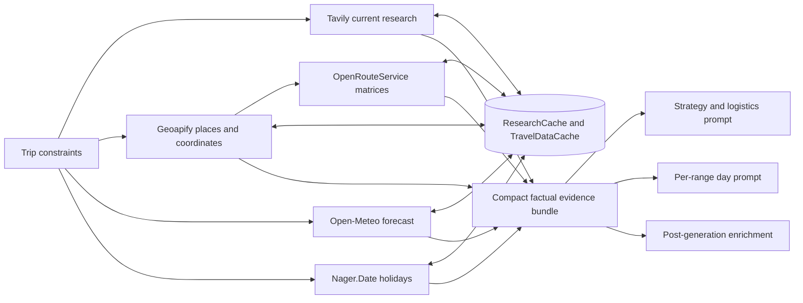

Provider calls are serialized per provider, throttled, timed out, cached, and converted into safe “unavailable” states when they fail. This is appropriate for free-tier protection.

### 4.2 Current source-of-truth boundary

The prompt says API data has priority, and post-processing matches generated names to known places. However, factual authority is not enforced as a hard data constraint:

- The evidence bundle contains only a bounded number of places.
- Each day range receives at most a subset of unused candidates.
- The model can emit a place not present in evidence.
- A string that looks like a named venue can pass structural validation.
- Unmatched places can survive as estimated information.

As a result, the current system is **evidence-assisted generation**, not **evidence-constrained generation**.

## 5. Persistence, cache, and resume model

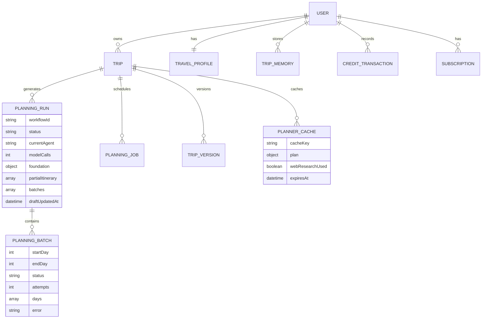

| Store | Purpose | Reliability effect |
|---|---|---|
| `Trip.aiPlan` | Last completed user-visible plan | Durable final output |
| `PlanningRun.foundation` | Strategy, logistics, research state | Avoids repeating foundation calls |
| `PlanningRun.partialItinerary` | Saved valid day objects | Allows long-trip resume |
| `PlanningRun.steps` | User-visible stage history | Explains current activity and providers |
| `PlanningJob` | Job/checkpoint and credit reservation metadata | Foundation for asynchronous work |
| `PlannerCache` | Completed plan reuse | Reduces Groq load |
| `ResearchCache` | Search and research reuse | Reduces Tavily/API load |
| `TravelDataCache` | Provider response reuse | Protects free-tier quotas |
| `ImageCache`, `WeatherCache` | UI enrichment reuse | Avoids repeated Pexels/weather calls |

## 6. Why itineraries often feel basic or generic

### 6.1 Root-cause chain

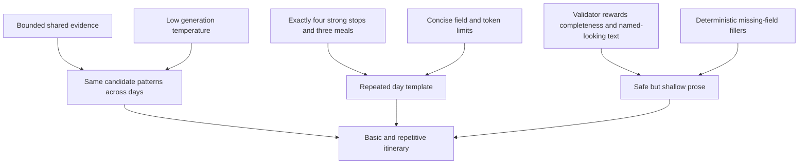

### 6.2 Specific causes in the current code

1. **Factual breadth is smaller than itinerary breadth.** A trip may need dozens of unique attractions, meals, hotels, and alternatives, while the compact evidence passed to a range is capped.

2. **Candidate selection is area-string based.** Relevant places are selected by comparing the day’s area text with place names and addresses. Weak area labels cause weak evidence selection.

3. **The model is allowed to invent outside the candidate set.** There is no required `placeId` on generated stops and meals.

4. **Structural validity is easier to prove than travel quality.** The validator can confirm four stops, numeric cost, transport, and non-placeholder text. It cannot confirm whether the sequence is culturally interesting or tailored to the traveler.

5. **Local normalization can mask weak generation.** `repairSafeDayOmissions` supplies practical-looking details, estimated times, transport, costs, and meal fields. This prevents schema failure but can convert a weak response into a generic valid response.

6. **A repeated output template is explicitly encouraged.** Compact retries request exactly four stops and three meals with short text fields. This reduces truncation but also reduces variety.

7. **Personalization is evaluated narratively, not measured.** The critic looks at authenticity and personalization, but there is no deterministic check that a minimum number of user interests appear in actual activities.

8. **One model family performs most reasoning roles.** Foundation, day authoring, criticism, and repair can share the same blind spots.

9. **The critic has limited repair authority.** Only two qualitative suggestions are accepted and the combined repair list is capped at four days.

10. **No destination-specific retrieval occurs for every day after the route is fixed.** A shared research bundle is reused rather than retrieving a small, precise candidate pack for each day/area.

## 7. Why failures happen at the last step

### 7.1 Validation timing mismatch

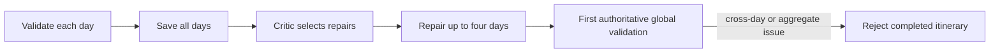

Local day validation does not have enough information to fully validate:

- Day N to day N+1 area transitions
- Duplicate attractions across the entire trip
- Aggregate category totals versus `totalEstimated`
- Budget verdict against all generated days
- Hotel continuity across destination changes
- Overall evidence coverage

These issues are discovered after the repair stage. The final gate cannot send them back through a guaranteed repair loop; it throws an error and depends on the next HTTP request to resume.

### 7.2 Repair-stage gaps

- Repair targets are computed before final enrichment and global validation.
- At most four day repairs are attempted.
- A model repair can fail and retain the original day.
- Deterministic fallback currently handles route-transfer repair well, but not every duplicate, venue, budget, or continuity issue.
- A repaired day may still have minor local issues and be accepted into the merge.
- On a complete resume, the general critic is skipped to save capacity. This is efficient, but any newly exposed qualitative defect receives less scrutiny.

### 7.3 “Saved” and “accepted” represent different states

The UI correctly displays saved days, but the product language can imply more certainty than the backend state provides:

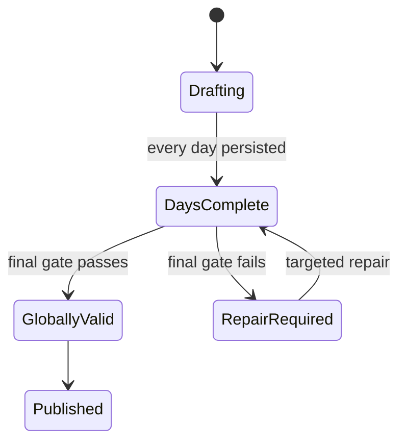

`DaysComplete` must remain distinct from `GloballyValid`. Combining them leads users to believe the planner failed arbitrarily at 100%.

## 8. Performance and reliability bottlenecks

| Priority | Bottleneck | User symptom | Technical cause | Existing mitigation | Required change |
|---|---|---|---|---|---|
| P0 | Global validation runs after repair | Failure at the final step | Cross-day checks are unavailable during local generation and not looped back | Saved resume state | Move global validation before the last repair pass and reconcile again afterward |
| P0 | Evidence-assisted rather than constrained generation | Invented or generic places | Stops do not require provider-backed IDs | Prompt authority and string matching | Generate from typed candidate packs; require evidence IDs or explicit `estimated` status |
| P0 | Final gate throws away a usable presentation | User sees failure despite complete days | Critical and non-critical defects share a terminal request path | Partial days remain saved | Return `repair_required` with a viewable draft and repair action; block publishing, not viewing |
| P1 | Long synchronous orchestration | Vercel timeouts and repeated resumes | Multiple model calls run inside one request lifecycle | Deadline checkpoint and resume | Execute a bounded slice per invocation or use a real background queue/worker |
| P1 | Model JSON truncation/invalidity | Batch split and repeated calls | Large schema plus multi-day output | Adaptive batching and compact retry | Use smaller typed intermediate records and deterministic assembly |
| P1 | Weak personalization measurement | Correct but bland itinerary | No interest-coverage score or novelty objective | Narrative critic | Add deterministic personalization and diversity metrics |
| P1 | Repair budget capped at four days | Remaining critical defect | Fixed repair list size | Deterministic route fallback | Prioritize all critical defects; cap optional refinements instead |
| P1 | Post-generation name matching | Real places remain unmatched | Fuzzy string comparison after generation | Geoapify enrichment | Carry provider place IDs from selection through final output |
| P2 | Provider candidate coverage | Same places reused or distant places chosen | One bounded destination-level search | Cache and area filtering | Retrieve/cache one candidate pack per route zone, not per itinerary item |
| P2 | Aggressive progress polling | Avoidable API/database reads | AI Planner polls every 2 seconds; sidebar polls every 5 seconds | Separate progress rate limit | Use exponential backoff or SSE where hosting permits |
| P2 | Cache compatibility drift | Old data can shape new plans | Multiple caches and workflow versions | Cache keys, TTL, workflow version | Version evidence schema and validator policy in every cache key |
| P2 | Single document plan growth | Slower writes for long plans | Entire mixed plan stored on Trip and caches | Batched PlanningRun drafts | Keep normalized day records until final publication |

## 9. Recommended target architecture

This proposal preserves the current agents and APIs. It changes data contracts and validation order rather than replacing the application.

### 9.1 Core architectural principle

Introduce a typed **Itinerary Intermediate Representation (IR)** as the source of truth. The LLM proposes selections and descriptions; deterministic services own identity, route times, totals, status, and final assembly.

Every planned stop should include:

```json
{
  "placeId": "provider-or-internal-id",
  "name": "Canonical place name",
  "coordinates": { "lat": 0, "lon": 0 },
  "evidenceStatus": "verified",
  "source": "geoapify",
  "estimated": false
}
```

If no factual source is available, the model may use an estimate only with:

```json
{
  "evidenceStatus": "estimated",
  "estimated": true,
  "verificationAction": "Confirm the venue and hours before booking"
}
```

### 9.2 Target planner flow

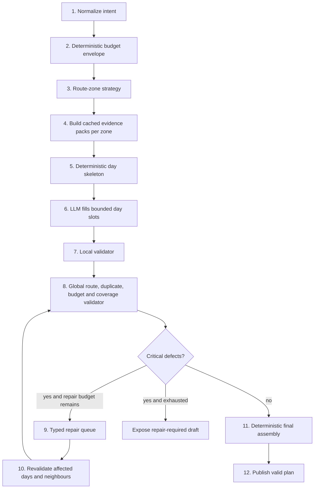

### 9.3 Evidence pack per route zone

Do not call an API for every itinerary item. Make one cached call bundle per route zone:

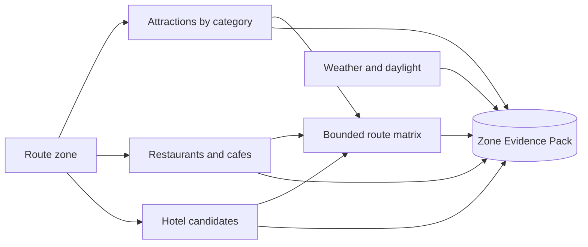

Recommended pack limits:

- 12–20 attractions per zone across traveler-relevant categories
- 6–10 food candidates per zone with cuisine tags
- 3–5 hotel candidates per overnight zone
- Route matrix only for shortlisted candidates, not every provider result
- Cache by destination, zone, season, travel mode, and evidence-schema version

This produces better factual breadth with fewer calls than per-item lookups.

### 9.4 Typed repair loop

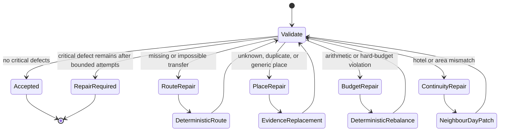

Only descriptive or preference conflicts should require an LLM repair. Route insertion, budget arithmetic, duplicate replacement from an evidence pack, and continuity should be deterministic wherever possible.

### 9.5 Final assembly must be non-generative

The final planner should not invent or reinterpret content. It should:

1. Sort and merge validated day records.
2. Recompute all day and trip totals.
3. Attach canonical provider metadata.
4. Calculate factual coverage and quality metrics.
5. Produce the final API representation.

If this assembly is deterministic, the final step cannot introduce a new hallucination.

## 10. Quality model

### 10.1 Separate validity from quality

| Dimension | Blocking validity rule | Non-blocking quality score |
|---|---|---|
| Places | Required stop has a canonical name or explicit estimate status | Percentage of stops verified by providers |
| Route | Every area change has numeric transfer time and mode | Route efficiency and backtracking |
| Budget | Components equal total and hard-budget verdict is correct | Value for money |
| Schedule | No impossible overlap and every stop has duration | Pace and rest balance |
| Personalization | Safety/avoidance constraints cannot be violated | Interest coverage and experience fit |
| Diversity | No accidental exact duplicates | Variety of categories and neighborhoods |
| Food | Named meal places or explicit estimated alternatives | Cuisine diversity and dietary fit |

### 10.2 Proposed deterministic metrics

- `verifiedPlaceCoverage`: verified scheduled places / all scheduled places
- `verifiedMealCoverage`: verified meal venues / all meal venues
- `routeCoverage`: transitions with API or explicit conservative estimates / all transitions
- `interestCoverage`: requested interests represented by at least one activity / requested interests
- `uniquePlaceRatio`: unique canonical place IDs / planned place visits
- `budgetIntegrity`: exact equality across components, daily totals, and total expected spend
- `restCompliance`: days meeting configured rest/buffer policy / all days
- `genericTextCount`: placeholder or vague phrases; blocking target is zero

## 11. Revised status contract

The backend and UI should use explicit states:

| Status | Meaning | User action |
|---|---|---|
| `running` | A planner slice is executing | Wait or navigate elsewhere |
| `checkpointed` | Hosting/model capacity ended safely | Resume |
| `days_complete` | Every day exists but global checks remain | No action yet |
| `repairing` | Critical global defects are being patched | Wait |
| `repair_required` | Viewable draft exists but cannot be published as final | Resume targeted repair |
| `completed_with_notes` | Valid plan with non-blocking quality notes | View/edit |
| `completed` | Valid plan without material notes | View/edit |
| `failed` | No safe continuation is available | Retry from the failed boundary |

The UI should not label a fully saved but globally invalid itinerary as a generic failure.

## 12. Incremental implementation plan

### Phase 0 — Observability and error taxonomy

Small, low-risk changes:

- Store validator issue codes, affected day numbers, severity, and repair type.
- Record timings and token estimates per stage.
- Record evidence-coverage metrics.
- Show `days_complete`, `repairing`, and `repair_required` distinctly.
- Add a generation ID, workflow version, prompt version, evidence version, and validator version.

### Phase 1 — Fix the late-failure loop

Highest-value reliability change:

1. Run global deterministic validation immediately after all days are generated.
2. Convert its issues into typed repair candidates.
3. Run critical repairs.
4. Recompute budget and travel enrichment.
5. Run the final gate.
6. If critical issues remain, return a viewable `repair_required` draft rather than a blank terminal failure.

This directly addresses the repeated last-step failure without a major rewrite.

### Phase 2 — Evidence-constrained day generation

- Build and cache candidate packs per route zone.
- Require provider/internal IDs for selected attractions, food, and hotels.
- Allow an explicit estimated record only when evidence is unavailable.
- Replace fuzzy post-generation matching with canonical IDs.
- Add category, interest, accessibility, indoor/outdoor, and weather-suitability tags.

### Phase 3 — Deterministic skeleton and repair services

- Allocate day areas, time windows, rest buffers, and budget envelopes before prose generation.
- Deterministically insert inter-zone transfers.
- Deterministically recompute budget totals.
- Replace duplicates from unused evidence candidates.
- Ask the model only for descriptions, personalization, and choices that need reasoning.

### Phase 4 — Execution model for long trips

Use `PlanningJob` as the durable coordinator:

- One invocation processes one bounded planner slice.
- A queue or scheduled worker claims the next slice.
- Credits are reserved once and settled once.
- Browser navigation has no effect on execution.
- Idempotency keys prevent duplicate slices.

If Vercel remains the only backend runtime, keep each invocation short and explicitly resume it. A continuously running worker on a suitable host is more reliable for 15–20 day plans.

### Phase 5 — Evaluation suite

Create a fixed dataset covering:

- 2, 5, 10, and 20-day trips
- One-city and multi-city routes
- Insufficient, realistic, generous, and unrealistic budgets
- Dietary/accessibility constraints
- Rainy season and winter travel
- Domestic and international trips
- Provider outage and Groq rate-limit simulations

Each fixture should assert both schema and travel semantics.

## 13. File-level change map

| File or module | Recommended responsibility change |
|---|---|
| `server/src/agents/graph.js` | Add pre-repair global validation and a bounded validation-repair loop |
| `server/src/agents/stages/stageSupport.js` | Return typed issue objects instead of relying mainly on strings |
| `server/src/agents/stages/criticStage.js` | Keep qualitative criticism separate from critical deterministic repairs |
| `server/src/agents/stages/repairStage.js` | Dispatch route, place, budget, and continuity repairs by issue type |
| `server/src/agents/stages/dayStage.js` | Generate against a zone candidate pack and require canonical IDs |
| `server/src/services/travelIntelligenceService.js` | Build zone packs and expose canonical candidate lookup |
| `server/src/services/planHelpers.js` | Manage durable states and return `repair_required` drafts safely |
| `server/src/models/PlanningRun.js` | Store issue queue, quality metrics, versions, and explicit workflow status |
| `server/src/models/PlanningJob.js` | Claim/retry bounded asynchronous slices with idempotency |
| `client/src/pages/AIPlanner.jsx` | Render explicit planner states and viewable repair-required drafts |
| `client/src/components/ai/AgentProgress.jsx` | Explain global validation and targeted repair without generic failure text |

## 14. Target service-level objectives

| Metric | Target |
|---|---:|
| Trips that finish without a terminal planner failure | at least 97% |
| Final-gate critical failure after all days are saved | below 2% |
| Exact budget arithmetic | 100% |
| Cross-zone transitions with numeric time and mode | 100% |
| Generic placeholder count in accepted plans | 0 |
| Verified scheduled-place coverage where provider is available | at least 85% |
| Accidental duplicate canonical places | 0 |
| Long-trip resume regenerating an already saved valid day | 0 |
| Optional critic/repair outage causing total plan loss | 0 |
| Provider calls | bounded by route zones, not itinerary item count |

## 15. Recommended decision

Do not add more agents first. The present bottleneck is not a shortage of agent roles; it is the contract between generation, factual evidence, validation, and repair.

The best next implementation sequence is:

1. Move global validation before the final repair opportunity.
2. Return a usable `repair_required` draft instead of treating every critical note as total failure.
3. Convert quality issues into typed repair records.
4. Carry canonical place IDs through day generation.
5. Add zone-level evidence packs and deterministic global reconciliation.
6. Move long-running planning to bounded durable jobs when deployment constraints require it.

This sequence improves reliability first, then factual specificity, without replacing the current multi-stage workflow or increasing Groq calls unnecessarily.

